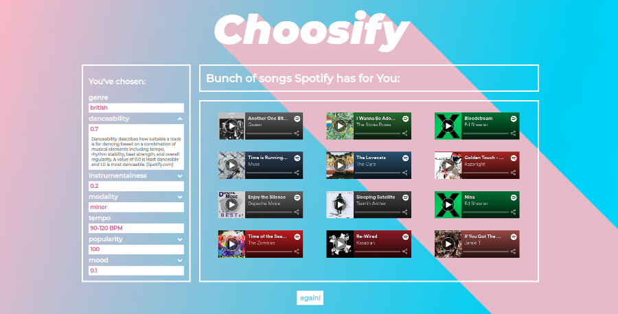

# Choosify - Spotify song recommendation APP using React & Spotify API



## Live demo

👉 [Click here](https://choosify.herokuapp.com/) 👈

## About

An app that asks You for your music preferences in multiple-step forms and based
on a given genre/danceability/instrumentalness/modality/tempo/popularity/valance
suggests twelve songs, that can be played in the iframe player or directly in
the Spotify App. The field on the left side shows and explains the user's
choice. The app consumes Spotify API.

## Technologies used

- React Hooks
- React-Redux
- Styled-Components
- Spotify API
- CSS Grid and CSS Flexbox

## Clone the repo and install the app:

```
$ npm install
$ npm start
```

Create an .env file and add your API Keys:

```

REACT_APP_CLIENT_ID=
REACT_APP_CLIENT_SECRET=

```

Restart the server and run the app in the development mode. Open
[http://localhost:3000](http://localhost:3000) to view it in the browser.
